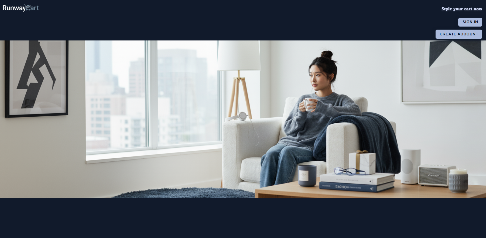
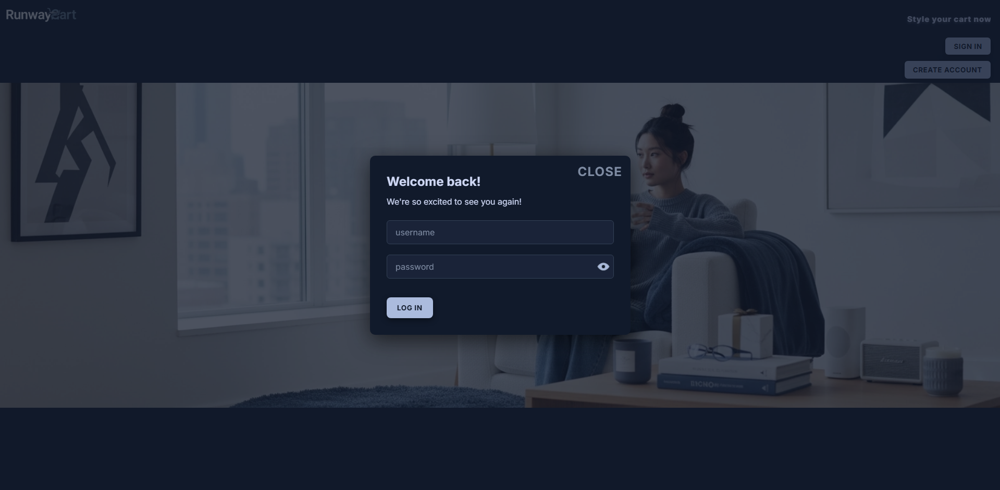
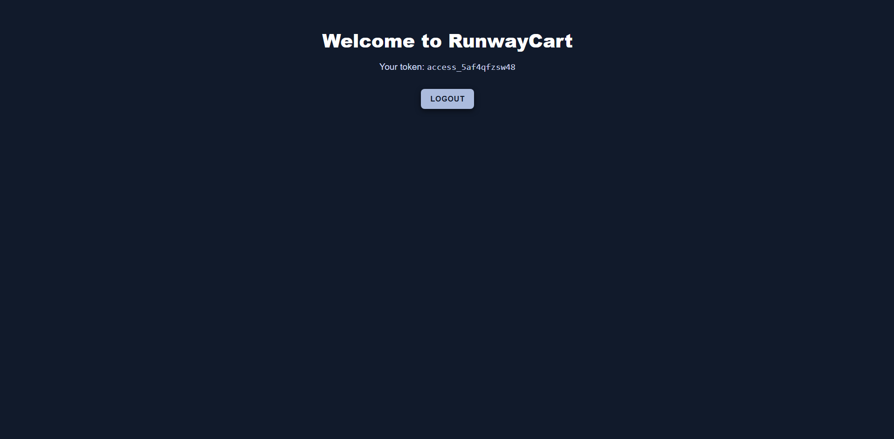
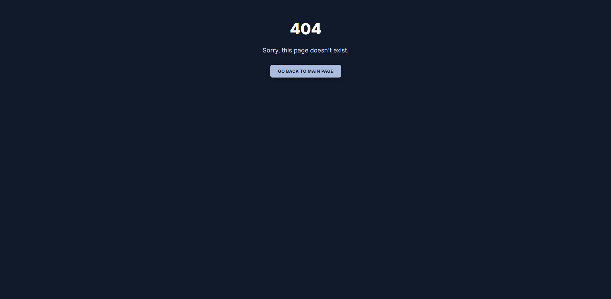

# 🛒 RunwayCart — Modern Authentication UI for E-Commerce


**RunwayCart** is a sleek, production-style authentication interface built with **React + Vite**, designed for an e-commerce experience in progress. It showcases how to implement secure, scalable, and user-friendly auth flows using real API integration — all wrapped in a clean, dark-themed UI.


## 🚀 Live Demo
 
> https://runwaycart.vercel.app/


---

## 📸 Screenshots

| Welcome Page                                 | Login Modal                                         | Authenticated Home                     | 404 - No Page Found                 |
|----------------------------------------------|-----------------------------------------------------|----------------------------------------|-------------------------------------|
|  |  |  | |

---


## ✨ Features

- 🔐 **JWT Authentication**  
    Integrates with `https://dummyjson.com/auth/login` for real credential-based login. Stores JWT securely in `localStorage`.
  
- 🔄 **Token Expiry & Refresh Simulation**  
    Tokens automatically expire in 2 minutes and are refreshed using a simulated mechanism to emulate production behavior.

- 🔒 **Protected Routes**  
    Authenticated users can access `/home`; others are redirected to the login screen, preserving route security.

- 🧠 **Accessible Login Modal**  
  - Implemented using **React Portals** for rendering outside the DOM hierarchy.
  - Enhanced for screen readers with `aria-label` on the close button.
  - Prevents background click propagation for better focus behavior and user flow.

- ✅ Robust Form Validation with Yup
  - Powered by **Yup** schema validation for clean, declarative rules.
  - Validates inputs with regex, length, and required fields.
  - Shows real-time feedback using accessible `aria` attributes.
  - Disables default form errors and handles submission manually for full control.

- 🌙 **Dark Mode UI**  
  - Custom-styled using modern CSS and responsive layouts.
  - Fully mobile-ready with scalable typography and components.

- 🚧 **404 Not Found Page**  
    A custom 404 page that detects authentication state:  
  - 🔒 If the user is logged in → redirects to `/home`  
  - 🔓 If not logged in → redirects to `/`  
    Helps users recover gracefully from dead ends with tailored navigation.

- 🛡️ AuthGuard Component
    Ensures no routes are rendered until the authentication status is fully resolved,
    improving UX with a loading state during app initialization.
    Additionally, it automatically redirects logged-in users away from the public root path (/) to the authenticated dashboard (/home), streamlining navigation and preventing unnecessary access to the welcome screen once authenticated.


---

## 📦 Built with

  - ⚛️ **React 19 + Vite 7**  
  - 🛤️ **React Router DOM v7** for routing  
  - 🧠 **React Context API** for global authentication state management  
  - ✅ **Yup** for form validation 
  - 🎨 **Custom CSS** (no frameworks)      
  - 💾 **LocalStorage** for token/session management   

---

## 📂 Folder Structure

📦 src
├── assets/           (planned)
├── components
│   ├── auth
│   │   └── AuthGuard.jsx
│   ├── forms
│   │   └── LoginForm.jsx
│   ├── Home/         (planned)
│   ├── modal
│   │   └── loginModal.jsx
│   └── ui
│       ├── Caption.jsx
│       └── PasswordEye.jsx
├── context
│   └── AuthContext.jsx
├── hooks/            (planned)
├── layouts/          (planned)
├── pages                     
│   ├── Home.jsx              
│   ├── NoPageFound.jsx       
│   └── Welcome.jsx           
├── routes                    
│   ├── AppRoutes.jsx         
│   └── PrivateRoute.jsx      
├── styles                    
│   ├── App.css       (planned)
│   ├── index.css
│   ├── Modal.css
│   └── Welcome.css
├── utils
│   └── auth.js
├── App.jsx
└── main.jsx

---

## 🔐 Authentication Details

  - ✅ API: `https://dummyjson.com/auth/login`
  - 🔐 Tokens currently stored in localStorage (client-side only). Will migrate to httpOnly cookies in future backend integration for enhanced security
  - ⏱️ Token expiry set to 2 minutes
  - 🔁 Token refresh simulated (not real backend refresh) 
  - 🔓 Logout clears all tokens and state
  - 🪟 Login is done via modal (not full page)

---

### 🧭 Dynamic 404 Handling

The app includes a custom 404 page that adapts dynamically based on the user's authentication state:
    
- If a logged-in user hits a bad route, they’re guided back to the dashboard (`/home`)
- If a guest user encounters a dead-end, they’re redirected to the main page (`/`)
  
This improves the overall navigation experience and ensures users are never stuck.

---

## 🧪 How to Run Locally


1. **Clone the repo**
   ```bash
   git clone https://github.com/Senchibab/runwaycart.git
   cd runwaycart
   ```

2. **Install dependencies**

    npm install

3. **Start the app**

  - npm run dev
  - Open http://localhost:5173 in your browser

4. **Login credentials**

    username: emilys
    password: emilyspass


📌 Notes

  - 🧪 This project currently uses **DummyJSON’s mock API** to simulate real login functionality.
  - 🛠️ A custom backend is in development using **Spring Boot** and **Java**, following **microservice architecture**.
  - 🔐 All tokens and auth flow are managed on the frontend for now.
  - 🗄️ No real user data or backend database is connected yet.


## 📈 Potential Improvements (Planned)

- 🔧 **Backend Integration with Spring Boot**  
  Replace DummyJSON with a secure backend, leveraging microservice architecture.

 - 🔐 **Secure JWT Storage**
      Migrate from `localStorage` to secure, HTTP-only cookies.

 - 🔄 **Multi-Tab Auth Sync**
      Implement `handleStorage` to synchronize login/logout state across multiple tabs using the `storage` event.

 - 🛂 **Role-Based Access Control (RBAC)**
      Introduce admin/user roles with protected routes and UI separation.

 - 🧩 **Expanded Auth Features**  
      Add sign-up, forgot password, and reset password workflows.

 - 🧪 **Testing & CI/CD**  
      Add Jest + RTL + MSW for test coverage, and GitHub Actions for CI/CD automation.

 - 📱 **Enhanced UX & Accessibility**  
      Add keyboard navigation, focus trapping, and mobile interaction improvements.

 - 📦 **Deployment & Hosting**  
      Containerize with Docker Compose and deploy full stack (Vercel, AWS, Render) with HTTPS.