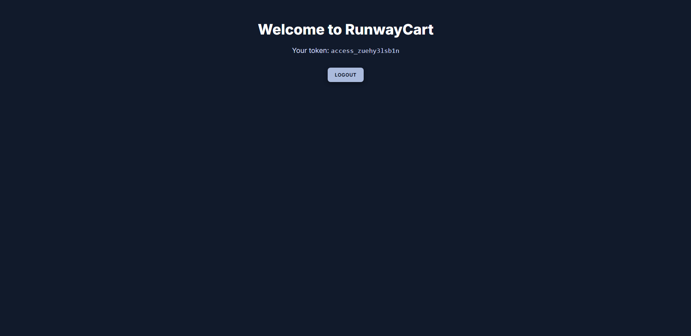

# 🛒 RunwayCart — Modern Authentication UI for E-Commerce


**RunwayCart** is a sleek, production-style authentication interface built with **React + Vite**, designed for an e-commerce experience in progress. It demonstrates **secure, performant, and user-friendly authentication flows** with real API integration, lazy loading, and analytics — all wrapped in a clean, dark-themed UI.


## 🚀 Live Demo
 
> [https://runwaycart.vercel.app/](https://runwaycart.vercel.app/)


---

## 📸 Screenshots

| Welcome Page                                 | Login Modal                                         | Authenticated Home                     | 404 - No Page Found                 |
|----------------------------------------------|-----------------------------------------------------|----------------------------------------|-------------------------------------|
|  |  |  | |

---


## ✨ Features

### 🔐 Authentication & Security

- **JWT Authentication**  
  Integrates with [`https://dummyjson.com/auth/login`](https://dummyjson.com/auth/login) for real credential-based login.  
  Tokens are securely stored in `localStorage` with automatic expiry simulation.

- **Token Expiry & Refresh Simulation**  
  Tokens expire after **2 minutes**, triggering a simulated refresh flow to mimic real backend behavior.

- **Protected Routes**  
  Guards pages using React Context + `PrivateRoute` ensuring only authenticated users can access `/home`.

---

### 🧠 User Experience & Accessibility

- **Accessible Login Modal**  
  - Rendered via React Portals.  
  - Includes ARIA labels and prevents background clicks for better focus control.  
  - Clean close animations and focus trapping for accessibility.

- **Custom Loader Component**  
  - Displays during login, authentication initialization, or lazy-loading states.  
  - Designed with a lightweight spinner and fade-in animation for smooth transitions.

- **Prefetch Optimization**  
  - Login modal is dynamically imported and preloaded in the background for faster interaction.

- **Lazy Loading with Fallback**  
  - Uses `React.lazy` + `Suspense` to defer non-critical components and reduce initial bundle size.

- **Dark Mode UI**  
  - Modern, contrast-rich palette built with custom **vanilla CSS** — no frameworks.  
  - Fully responsive and mobile-optimized layout.

- **Error Message System**  
  - Accessible validation alerts styled for clarity and color contrast compliance (WCAG AA+).

---

### ⚙️ Performance & Monitoring
- ⚡ **Vercel Speed Insights** — measures Core Web Vitals (LCP, FID, CLS) in production.  
- 📊 **Vercel Web Analytics** — cookieless, privacy-friendly visitor tracking.  
- 🧱 **Environment-Aware Setup** — analytics auto-disabled in local dev via `.env` flag.  
- 💡 **SEO Optimized** — metadata, manifest, and canonical tags for better indexing.  
- 🧩 **Preload Optimization** — background image preloaded for improved Largest Contentful Paint (LCP).

---

### 🧱 Architecture
- ⚛️ **React 19 + Vite 7** — modern, lightning-fast setup.
- 🧠 **React Context API** — global authentication state management.
- ✅ **Yup Validation** — declarative, schema-based form validation.
- 🧱 **Microservice-Ready Backend (Planned)** — Powered by Spring Boot and Java, with a roadmap to full microservice deployment using JPA, MSSQL, and Docker containerization.

---


## 📦 Built with

- ⚛️ **React 19 + Vite 7**  
- 🛤️ **React Router DOM v7** for routing  
- 🧠 **React Context API** for global authentication state management  
- ✅ **Yup** for form validation 
- 🎨 **Custom CSS** (no frameworks)      
- 💾 **LocalStorage** for token/session management   
- 📊 **Vercel (Hosting + Analytics)**

---

## 📂 Folder Structure

📦 src
├── assets/           (planned)
├── components
│   ├── auth
│   │   └── AuthGuard.jsx
│   ├── forms
│   │   └── LoginForm.jsx
│   ├── Home/         (planned)
│   ├── modal
│   │   └── loginModal.jsx
│   └── ui
│       ├── Caption.jsx
│       ├── PasswordEye.jsx
│       └── Loader.jsx
├── context
│   └── AuthContext.jsx
├── hooks/            (planned)
├── layouts/          (planned)
├── pages                     
│   ├── Home.jsx              
│   ├── NoPageFound.jsx       
│   └── Welcome.jsx           
├── routes                    
│   ├── AppRoutes.jsx         
│   └── PrivateRoute.jsx      
├── styles                    
│   ├── App.css       (planned)
│   ├── index.css
│   ├── Loader.css
│   ├── Modal.css
    └── Welcome.css
├── utils
│   └── auth.js
├── App.jsx
└── main.jsx

---

## 🔐 Authentication Details

  - ✅ API: `https://dummyjson.com/auth/login`
  - 🔐 Tokens currently stored in localStorage (client-side only). Will migrate to httpOnly cookies in future backend integration for enhanced security
  - ⏱️ Token expiry set to 2 minutes
  - 🔁 Token refresh simulated (not real backend refresh) 
  - 🔓 Logout clears all tokens and user session
  - 🪟 Login is Modal-based authentication (no page reload)

---

### 🧭 Dynamic 404 Handling

The app includes a custom 404 page that adapts dynamically based on the user's authentication state:
    
  - 🔒 If logged in → Redirects to `/home`  
  - 🔓 If not logged in → Redirects to `/`  
    Keeps users within valid navigation boundaries and improves recovery from broken links.

---

## 🧪 How to Run Locally


1. **Clone the repo**
  ```bash
  git clone https://github.com/Senchibab/runwaycart.git
  cd runwaycart

2. **Install dependencies**

  npm install

3. **Start the app**

  - npm run dev
  - Open http://localhost:5173 in your browser

4. **Login credentials**

  username: emilys
  password: emilyspass


📌 Notes

- 🧪 This project currently uses **DummyJSON’s mock API** to simulate real login functionality.
- 🛠️ A custom backend is in development using **Spring Boot** and **Java**, following **microservice architecture**.
- 🔐 All tokens and auth flow are managed on the frontend for now.
- 🗄️ No real user data or backend database is connected yet.


## 📈 Potential Improvements (Planned)

🧱 Backend Integration (Spring Boot + Microservices)

🔐 Secure JWT via HttpOnly cookies

🔄 Multi-tab Auth Sync

🧩 Sign-up / Forgot Password / Reset Password

🛂 Role-Based Access Control (RBAC)

🧪 Testing & CI/CD with Jest, React Testing Library, and GitHub Actions

📱 Enhanced UX & Accessibility

🐳 Containerization with Docker & deployment pipeline